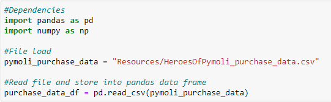
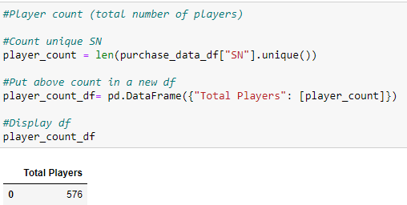
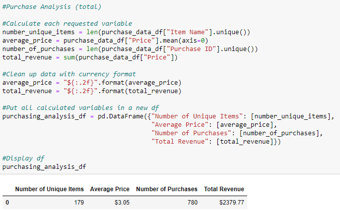
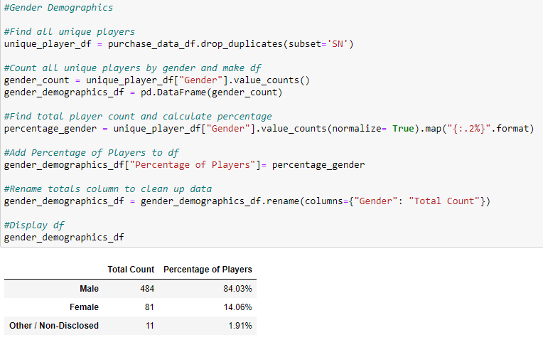
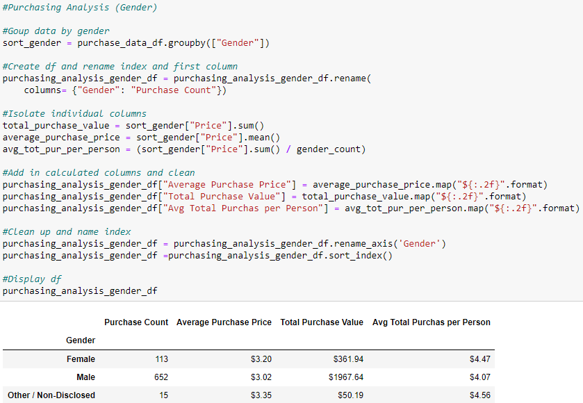
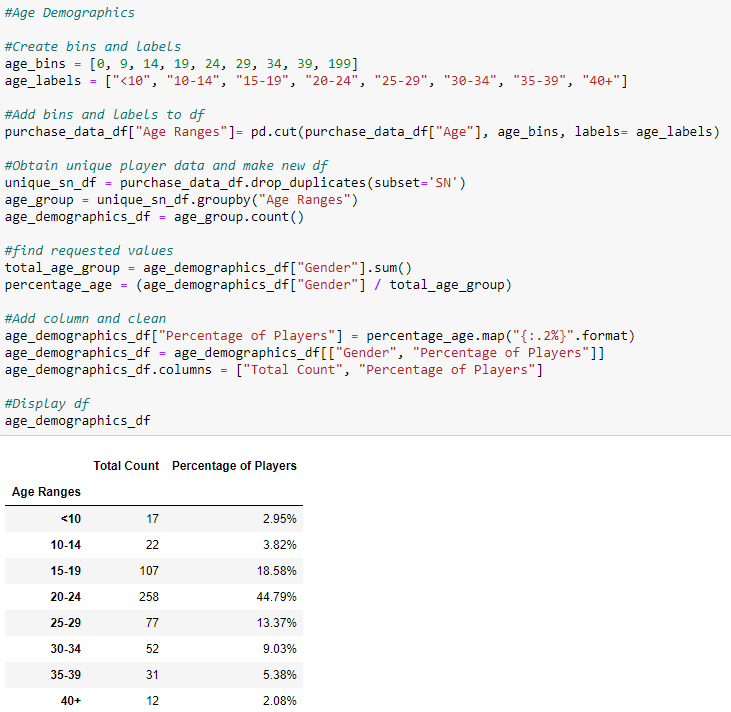
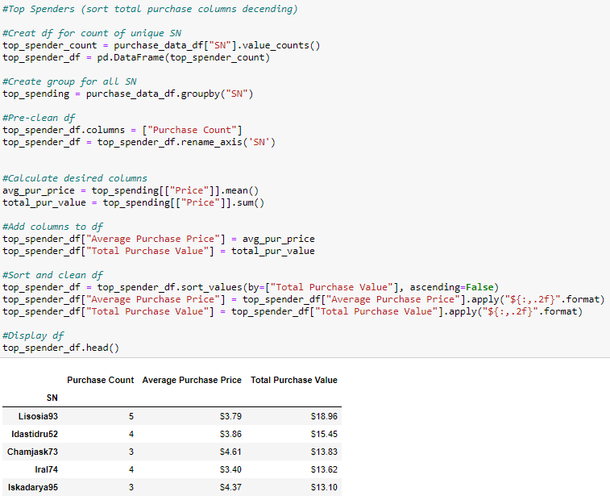
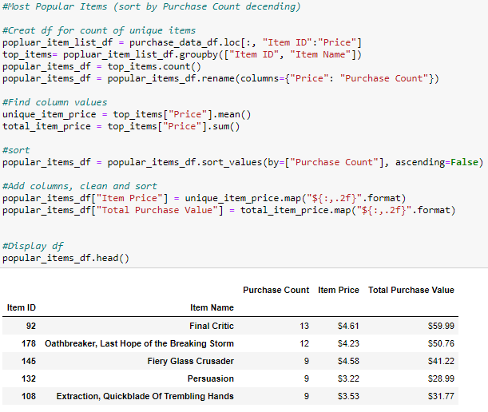
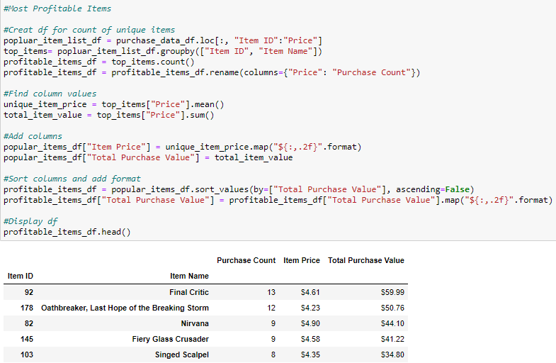

# pandas-challenge

This simulated task is to analyze the data for an independent gaming companies most recent fantasy game Heroes of Pymoli.
Like many others in its genre, the game is free-to-play, but players are encouraged to purchase optional items that enhance their playing experience. 
As a first task, the company would like you to generate a report that breaks down the game's purchasing data into meaningful insights.

## Objectives:
Report shold appear as follows: 
(Note github is not able to render all data frames nicely. Pictures were loaded from jupyter notebook)

### Dependencies

### Player Count
* Total Number of Players

### Purchasing Analysis (Total)
* Number of Unique Items
* Average Purchase Price
* Total Number of Purchases
* Total Revenue

### Gender Demographics
* Percentage and Count of Male Players
* Percentage and Count of Female Players
* Percentage and Count of Other / Non-Disclosed

### Purchasing Analysis (Gender)
* The below each broken by gender
  * Purchase Count
  * Average Purchase Price
  * Total Purchase Value
  * Average Purchase Total per Person by Gender

### Age Demographics
* The below each broken into bins of 4 years (i.e. &lt;10, 10-14, 15-19, etc.)
  * Purchase Count
  * Average Purchase Price
  * Total Purchase Value
  * Average Purchase Total per Person by Age Group

### Top Spenders
* Identify the the top 5 spenders in the game by total purchase value, then list (in a table):
  * SN
  * Purchase Count
  * Average Purchase Price
  * Total Purchase Value
  

  
  
### Most Popular Items
* Identify the 5 most popular items by purchase count, then list (in a table):
  * Item ID
  * Item Name
  * Purchase Count
  * Item Price
  * Total Purchase Value

### Most Profitable Items
* Identify the 5 most profitable items by total purchase value, then list (in a table):
  * Item ID
  * Item Name
  * Purchase Count
  * Item Price
  * Total Purchase Value

## Observable trends:
 * While there are indeed more males in the game, gender has little influence on how much each player spends. The percentage of sex is very close to percentage      of total purchase.
 * The main target range for the age of players is between 15-29, with the vast majority between 20-24. Age also has little effect on percent purchase per          person. Eventhough the younger and older players are still out of the target range, they still are purchasing close to the average persons expendature. (Price    range is between $ (3.19) - $ (4.76) for age groups)
 * Players tend not to purchase many items (only three players purchased more than 3 items), thus each player is likely to buy at least one item.
